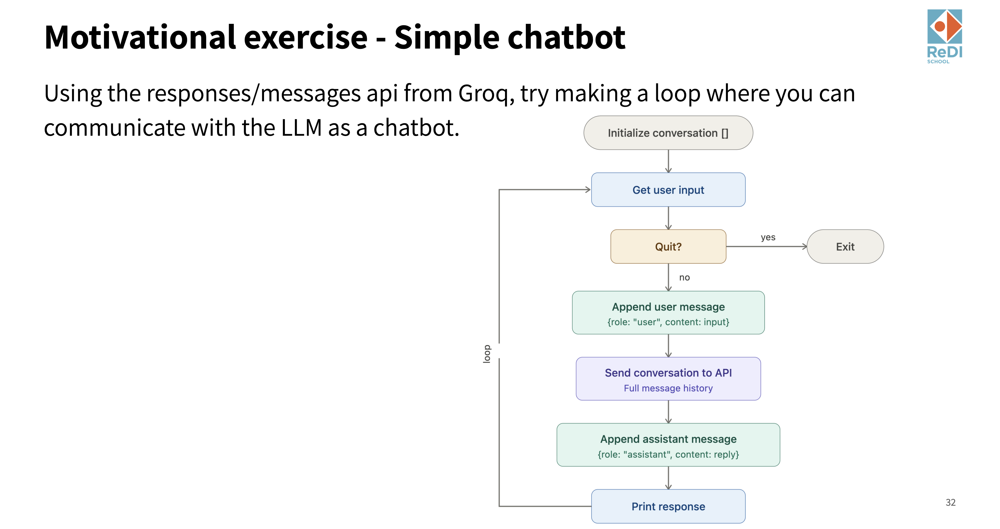

# Homework 4

## Setup

Create a virtual environment and install the required dependencies:

```bash
python -m venv venv
source venv/bin/activate  # On Windows: venv\Scripts\activate
pip install openai python-dotenv colorama jupyter
```

Create a `.env` file in this folder with your API key:

```
GROQ_KEY=your_api_key_here
```

**Never hardcode API keys in your code.** Use `python-dotenv` to load them.

---

## Exercise 1: LLM API Usage — Text Classification

**File:** `exercise1 - api usage.py`

Implement three classification functions that use the Groq API to categorize text. A test harness is provided — run the file to check your accuracy.

### Tasks

1. **Sentiment Analysis** — Classify product reviews as `Positive`, `Neutral`, or `Negative`
2. **E-mail Classification** — Route e-mails to the correct department: `Sales and Pre-Sales`, `IT Support`, `Returns and Exchanges`, or `Human Resources`
3. **Content Moderation** — Decide whether a chat message should be `allowed` or `filtered`

### Running

```bash
python "exercise1 - api usage.py"
```

See `assignment 1.md` for full details.

---

## Exercise 2: Model Parameters

**File:** `exercise2 - model parameters.ipynb`

Open the Jupyter notebook and experiment with different model parameters (`temperature`, `max_tokens`, `top_p`) to observe how they affect the model's output.

```bash
jupyter notebook "exercise2 - model parameters.ipynb"
```

See `assignment 2.md` for full details.

---

## Exercise 3: Simple Chatbot (Bonus)

Build a simple chatbot that lets you have a multi-turn conversation with an LLM using the Groq API.



### Instructions

1. Initialize an empty conversation list
2. In a loop:
   - Get user input
   - If the user types "quit" (or similar), exit the loop
   - Append the user's message to the conversation (`role: "user"`, `content: <input>`)
   - Send the full conversation history to the API
   - Append the assistant's reply to the conversation (`role: "assistant"`, `content: <reply>`)
   - Print the response
3. The key idea is that you send the **full message history** each time, so the LLM has context of the entire conversation

### Tips

- Start simple: get a single request/response working first, then add the loop
- Remember to append **both** the user message and the assistant reply to the conversation list
- Test with short conversations to make sure context is maintained (e.g., "My name is X" followed by "What is my name?")
